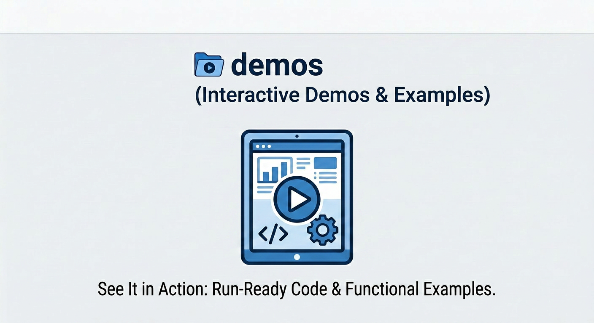

# Meta + Google Cloud: AI Co-Innovation Space - Tutorials
This repository features a collection of end-to-end demos, showcasing real-world applications and production-grade architectures built with Meta’s Llama models on Google Cloud infrastructure.

---

## 📂 Repository Structure

| Module | Description |
| :--- | :--- |
| [**`vogue-concierge`**](./vogue-concierge) | **Vogue Concierge AI Boutique** is production-grade AI demo that converges the roles of personal stylist, inventory specialist, and fashion advisor into a single conversation, demonstrating how a grounded AI agent can transform vast fashion datasets into a seamless, concierge-style experience.   The architecture features **Llama models** served via **Vertex AI MaaS** and an **Agent Development Kit (ADK)** based agent on **Agent Engine**, utilizing **Vertex AI Search** for RAG-driven catalog insights, **BigQuery** for real-time inventory and loyalty data, and **Google Cloud Storage** for media assets—all delivered through a high-performance web app on **Cloud Run**. 

---
