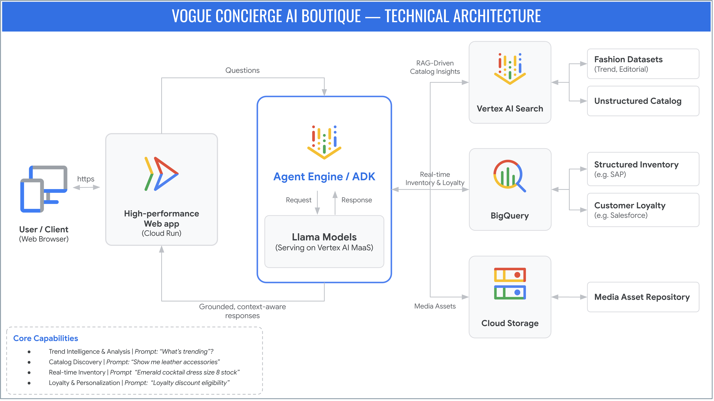

#  **Demo: Universal Retail Concierge Agent**
**Tech Stack:** `Python`, `Google Cloud ADK`, `Vertex AI MaaS`, `VertexAI Search Engine`, `Agent Engine`, `Cloud Run`, `BigQuery`, `Google Cloud Storage`

# **1\. Introduction**

**Vogue Concierge AI Boutique** is production-grade AI demo that converges the roles of personal stylist, inventory specialist, and fashion advisor into a single conversation, demonstrating how a grounded AI agent can transform vast fashion datasets into a seamless, concierge-style experience.

The architecture features **Llama models** served via **Vertex AI MaaS** and an **Agent Development Kit (ADK)** based agent on **Agent Engine**, utilizing **Vertex AI Search** for RAG-driven catalog insights, **BigQuery** for real-time inventory and loyalty data, and **Google Cloud Storage** for media assets—all delivered through a high-performance web app on **Cloud Run**.

### **Core Demo Capabilities**

The **Vogue Concierge AI Boutique** showcases a versatile range of capabilities that transform a standard e-commerce interaction into a high-touch, personalized consultation. By unifying unstructured trend data with structured inventory and loyalty systems, the agent shifts seamlessly between a creative stylist and a precise data analyst. Whether a user is seeking aesthetic inspiration for a specific event or performing a technical stock lookup, the agent provides grounded, context-aware responses that mirror the expertise of a seasoned fashion professional. 

The demo showcases the following capabilities:

* **Contextual Occasion-Based Styling:** Recommends curated looks based on specific events, climates, and dress codes.  
  * *Prompt: "I'm attending a summer wedding in Tuscany. What should I wear?"*  
      
* **Intelligent Catalog Discovery:** Replaces rigid filters with a natural language interface for browsing specific materials, categories, or collections.  
  * *Prompt: "Show me leather accessories."*  
      
* **Real-Time Inventory & Stock Management:** Directly queries backend inventory data to verify size availability and stock levels.  
  * *Prompt: "Check if the Emerald Cocktail Dress is in stock in size 8."*

* **Trend Intelligence & Analysis:** Leverages the search engine to provide insights into current fashion movements and "What's Hot" editorial content.  
  * *Prompt: "What’s trending?"*  
      
* **Loyalty & Personalization Integration:** Accesses secure customer data to provide loyalty status updates and verify discount eligibility.  
  * *Prompt: "Do I qualify for a loyalty discount? My customer ID is CUST-1042."*  
      
* **End-to-End Outfit Curation:** Moves beyond single-item search to build complete, cohesive ensembles for professional or social settings.  
  * *Prompt: "I need a complete outfit for a business dinner — something elegant but modern."*  
      
* **Automated Policy Assistance:** Provides instant, accurate answers regarding store procedures, returns, and shipping.  
  * *Prompt: "What’s your return policy for sale items?"*

### **Technical Architecture**



| Technical Component | Purpose |
| :---- | :---- |
| Cloud Run | Hosts the high-performance web application, serving as the user-facing frontend and entry point for the demo. |
| Agent Development Kit (ADK) | Open source agent development framework used to build the agent. The ADK agent functions as the central orchestrator that manages the conversational flow, interprets user intents, and routes requests to the appropriate data sources or models. |
| Agent Engine | Managed service that hosts and scales the agent |
| Llama Models (Vertex AI MaaS) | Provides the core generative AI and natural language processing capabilities, enabling the agent to converse naturally, understand context, and act as a creative fashion advisor. |
| Vertex AI Search | Enables Retrieval-Augmented Generation (RAG) by searching unstructured data to provide intelligent catalog discovery, trend analysis, and store policy assistance. |
| BigQuery | Acts as the structured data warehouse, queried in real-time to accurately verify inventory stock levels, size availability, and customer loyalty status. |
| Google Cloud Storage (GCS) | Securely stores and delivers all media assets, such as product images and styled ensemble visuals presented within the chat interface. |

# **2\. Demo Video**

#TODO: Demo video

# **3\. Installation**

### **Pre-requisites and Setup**

Before you begin, ensure you have the following:

#### **Google Cloud Resources**

* A [**Google Cloud Project**](https://console.cloud.google.com/projectselector2/home/dashboard) with [billing](https://docs.cloud.google.com/billing/docs/how-to/verify-billing-enabled#confirm_billing_is_enabled_on_a_project) enabled.  
* **Enabled APIs:**
  * [**Vertex AI API**](https://console.cloud.google.com/flows/enableapi?apiid=aiplatform.googleapis.com)   
  * [**Compute Engine API**](https://console.cloud.google.com/flows/enableapi?apiid=compute.googleapis.com)  
  * [**Resource Manager API**](https://console.cloud.google.com/flows/enableapi?apiid=cloudresourcemanager.googleapis.com)  
  * [**Google Cloud Storage API**](https://console.cloud.google.com/flows/enableapi?apiid=storage.googleapis.com)  
  * [**BigQuery API**](https://console.cloud.google.com/flows/enableapi?apiid=bigquery.googleapis.com)  
  * [**Discovery Engine API**](https://console.cloud.google.com/flows/enableapi?apiid=discoveryengine.googleapis.com)  
  * [**Cloud Build API**](https://console.cloud.google.com/flows/enableapi?apiid=cloudbuild.googleapis.com)  
  * [**Cloud Run API**](https://console.cloud.google.com/flows/enableapi?apiid=run.googleapis.com)  
  * [**Cloud Functions API**](https://console.cloud.google.com/flows/enableapi?apiid=cloudfunctions.googleapis.com)  
  * [**IAP API**](https://console.cloud.google.com/flows/enableapi?apiid=iap.googleapis.com)  
* **Model Access:**   
  * [**Llama 4 API Service**](https://console.cloud.google.com/vertex-ai/publishers/meta/model-garden/llama-4-maverick-17b-128e-instruct-maas) (MaaS) enabled or	 [**Llama 3.3 API Service**](https://console.cloud.google.com/vertex-ai/publishers/meta/model-garden/llama-3.3-70b-instruct-maas) (MaaS) enabled  
* **Service Accounts:**  
  * [**New**](https://docs.cloud.google.com/iam/docs/service-accounts-create) (Recommended) or existing service account for Cloud Run

#### **Local Development Environment**

* **uv** [installed](https://docs.astral.sh/uv/getting-started/installation/) and Python 3.10+ [installed using uv](https://docs.astral.sh/uv/guides/install-python/)
* **nvm** [installed](https://github.com/nvm-sh/nvm?tab=readme-ov-file#installing-and-updating) and Nodejs v22.19.0+ [installed using nvm](https://github.com/nvm-sh/nvm?tab=readme-ov-file#usage)
* **gcloud CLI** [installed](https://docs.cloud.google.com/sdk/docs/install-sdk) and [authenticated](https://docs.cloud.google.com/sdk/docs/install-sdk#initializing-the-cli).

### **Demo Deployment**

**NOTE: DON’T DEPLOY THIS IN YOUR PRODUCTION ENVIRONMENTS. This demo is solely for showing the art of the possible, so deploy only in Sandbox environments**

The deployment is automated as much as possible through values in a configuration file. Follow the steps below to deploy this in your sandbox environment

#### **\#1: Clone this demo folder to your local environment**

Clone only this folder selectively using the steps below

```shell

# Clone the repository without downloading the files
git clone --no-checkout https://github.com/PTA-Co-innovation-Team/META-Google-Co-Innovation.git

# Navigate into the newly created repository directory
cd META-Google-Co-Innovation

# Initialize sparse-checkout
git sparse-checkout init --cone

# Specify the folder that has the demo package
git sparse-checkout set 03-demos/vogue-concierge

# Checkout the main branch
git checkout main

# Navigate to the demo folder
cd 03-demos/vogue-concierge
```

#### **\#2: Update the config.yml file**

Make sure you are in the **META-Google-Co-Innovation/03-demos/vogue-concierge** folder. In this folder, you will see a **config.yml** file. Update the entries as per the guidance below

| Field | Purpose | Is an update required? |
| :---- | :---- | :---- |
| global: project\_id | Your Google Cloud project ID where this demo will be deployed (e.g.: my-google-cloud-project) | Yes, required |
| global: project\_number | Your Google Cloud project number where this demo will be deployed (e.g.: 123456789123). We need this as some services like Agent Engine reasoning engine use this for resource identification **Note:** This should be a numeric value and you should be able to get this from the [https://console.cloud.google.com](https://console.cloud.google.com)  | Yes, required  |
| global: cloud\_run\_sa | Service account that you created for Cloud run in the pre-requisites section. It is a good practice to use a dedicated service account for your Cloud Run services (rather than using the default compute engine service account) so that you can fine tune the resource access Don’t worry about the IAM access roles for now, we have provided a tool to automate this (more later) | Yes, required |
| global: region | The region where resources will be deployed unless otherwise overridden at resource level | Yes, required |
| vertexai: region | The region where your LLM is hosted on VertexAI. For example, Llama4 MaaS is available in us-east5 or Llama3.3 MaaS is available in us-central1. Please refer to this [link](https://docs.cloud.google.com/vertex-ai/generative-ai/docs/learn/locations#genai-open-models) to know which region is MaaS supported for your model choice | Yes, required |

<br>

**The following fields are optional \- you can keep the values as-is if it works for you**
| Field | Purpose | Is an update required? |
| :---- | :---- | :---- |
| agent\_engine: region | The region where Agent Engine resource will be deployed  | No, optional |
| cloud\_run: region | The region where Cloud run service will be deployed | No, optional |
| cloud\_run: use\_iap | This flag controls if the deployed Cloud Run supports Identity Aware Proxy (IAP). We recommend keeping this as ‘TRUE’. Change it to ‘FALSE’ if you don’t want to use IAP | No, optional |
| agent: name | The name for the agent that is deployed to agent engine | No, optional |
| agent: local\_port | The local port where the agent will listen when testing locally. Change this only if the port number 8000 is not available | No, optional |
| agent: datastores: bq: dataset\_id | This is the dataset ID for the BigQuery tables | No, optional |
| agent: datastores: bq: dataset\_desc | This is the BigQuery dataset description | No, optional |
| agent: datastores: bq: dataset\_location | The location where the dataset will be created | No, optional |
| agent: datastores: bq: inventory\_table\_name | The name for the inventory table that will be created in the BigQuery dataset | No, optional |
| agent: datastores: bq: loyalty\_table\_name | The name for the customer loyalty table that will be created in the BigQuery dataset | No, optional |
| agent: datastores: bq:imagegen:use | Leave it “FALSE” if you don’t want to generate your own product images using imagegen model. We have already attached imagegen generated images with this repo. But if you fancy creating your own images, flip this to “TRUE”  | No, optional |
| agent: datastores: bq:imagegen:model\_id | The model to use for creating product images | No, optional |
| agent: datastores: bq:imagegen:region | Google cloud region where the imagegen model is available | No, optional |
| agent: datastores: bq:storage:bucket\_name | This is the bucket where the product images and other staging data is stored. The utility tool we have provided will append this name to your project number to create a unique bucket in your project. | No, optional |
| agent: datastores: bq:storage:bucket\_location | The location where the above bucket is created | No, optional |
| agent: datastores: bq:rag:region | The region where RAG corpus will be deployed | No, optional |
| agent: datastores: bq:rag:corpus\_name | The name to use for the RAG corpus | No, optional |
| agent: datastores: bq:rag:corpus\_desc | The name to use for the RAG description | No, optional |
| api: name | Cloud Run service name | No, optional |
| api: local\_port | The local port where the web app will be available when testing locally. Change this only if the port number 8080 is not available | No, optional |
| api: remote\_port | The port where the Cloud Run service will be available. Change this only if you strongly feel about changing the default 8080 port for Cloud Run | No, optional |


**Don’t change the values for the following fields**


| Field | Purpose | Is an update required? |
| :---- | :---- | :---- |
| agent: use\_vertexai | Keep this “TRUE” as Llama models are available only on VertexAI. | Don’t update |
| agent: google\_api\_key | Leave it as-is. Maybe used in future | Don’t update |
| agent: folder | Leave it as-is. This is the folder where the ADK agent code resides | Don’t update |
| agent: datastores: bq:storage:image\_folder | Bucket folder name for storing the product images | Don’t update |
| agent: datastores: bq:storage:data\_folder | Bucket folder name for storing the data files  | Don’t update |
| agent: datastores: bq:storage:rag\_folder | Bucket folder name for storing the RAG data | Don’t update |
| agent: datastores: bq:storage:product\_data\_file | Product data file | Don’t update |
| agent: datastores: bq:storage:trend\_report\_file | Trend report file for loading to RAG corpus | Don’t update |
| agent: datastores: bq:storage:catalog\_file | Catalog file for loading to RAG corpus | Don’t update |
| api: folder | The folder where the code for the api backend is available | Don’t update |
| ui: folder | The folder where the code for the  frontend is available | Don’t update |

#### **\#3: Initialize the deployment**

Make sure you are in the **META-Google-Co-Innovation/03-demos/vogue-concierge** folder before executing the following commands

```shell

# Create a Python virtual environment
uv venv

# Activate the virtual environment
source .venv/bin/activate

# Install all dependencies
uv sync

# Run project initialization. This step performs the following
# - Builds the Next Single Page App (SPA)
# - Creates local folder for capturing deployment results
# - Creates/Update .env file used by the Web app
# - Creates/Update .env file used by the agent
# - Enables required APIs in your Google Cloud project if you missed something in the pre-requisites
uv run main.py -o init
```

#### **\#4: Load Data**

This step creates Google Cloud Storage Buckets, BigQuery dataset/tables and RAG corpus. It also creates all the images using imagen and loads all the required data to the respective resources

```shell

# Create required resources and load demo data
uv run main.py -o load-data
```

Once the required data is created, you can quickly test the agent using the out of the box UI available with ADK

```shell

# Create required resources and load demo data
adk web
```

Once the agent has started, navigate to [http://localhost:8000](http://localhost:8000) to load the ADK web UI. From the dropdown for choosing the agent, choose ‘vogue\_concierge\_agent’. Try the following prompts

*Hi there\! What can you help me with?*  
*Show me leather accessories*  
*What’s trending?*

#### **\#5: Deploy Agent to Agent Engine**

In this step, you will deploy the agent to the agent engine. Also, this step automatically grants the following roles (see file deploy/required.auth.yml for more details) to the agent engine service account - PROJECT_NUMBER@gcp-sa-aiplatform-re.iam.gserviceaccount.com
* *roles/aiplatform.viewer*
* *roles/bigquery.dataViewer*
* *roles/bigquery.jobUser*
* *roles/storage.objectViewer*

```shell

# Deploy agent to Agent Engine
uv run main.py -o deploy-agent
```

#### **\#6: Deploy the web app to Cloud Run**

In this step, you will deploy the web app to Cloud Run. Also, this step automatically grants the following roles (see file deploy/required.auth.yml for more details) to the cloud run service account you provide in the config
* *roles/aiplatform.viewer*
* *roles/bigquery.dataViewer*
* *roles/bigquery.jobUser*
* *roles/storage.objectViewer*
* *roles/iam.serviceAccountTokenCreator*

Further, since Cloud Build is used to deploy the Cloud Run service, this step also  automatically grants the following roles (see file deploy/required.auth.yml for more details) to the compute engine default service account - PROJECT_NUMBER-compute@developer.gserviceaccount.com
* *roles/storage.objectViewer*
* *roles/logging.logWriter*
* *roles/artifactregistry.writer*

```shell

# Deploy web app to Cloud Run
uv run main.py -o deploy-app
```

#### **\#7: Test the agent locally**

In this step, you can test the agent locally

```shell

# Test the agent locally
uv run main.py -o test-agent-local
```

#### **\#8: Test the Agent Engine Agent**

In this step, you can test the remote agent that is deployed on Agent Engine

```shell

# Test the agent locally
uv run main.py -o test-agent-remote
```

#### **\#9: Test the web app and agent locally** 

In this step, you can test the web app along with an agent instance running locally

```shell

# Test the agent locally
uv run main.py -o test-app-local
```

Once the web app and agent starts locally, navigate to [http://localhost:8080](http://localhost:8080) to access the agent UI. Try a few prompts to see how the agent responds.

**Note:** If the product images are not loading, it is because your ADC credentials don't have the [Service Account Token Creator](https://docs.cloud.google.com/iam/docs/service-account-permissions#token-creator-role) role on the Cloud Run service account. This role is needed so that you can impersonate the Cloud Run service account to create short lived urls for the product image files from the Google Cloud Storage Bucket.

```shell

# Assuming you are using a user ID 
gcloud projects add-iam-policy-binding <YOUR PROJECT ID> \
    --member="user:name@example.com" \
    --role="roles/iam.serviceAccountCreator"

# If you are using a service account for ADC credentials, then do this
gcloud projects add-iam-policy-binding <YOUR PROJECT ID> \
    --member="serviceAccount:serviceAccount@example.com" \
    --role="roles/iam.serviceAccountCreator"
```

#### **\#10: Test the web app locally but with the agent from agent engine**

In this step, you can run the web app locally but test accessing the remote agent deployed in agent engine

```shell

# Test the agent locally
uv run main.py -o test-app-remote
```

Once the web app and agent starts locally, navigate to [http://localhost:8080](http://localhost:8080) to access the agent UI. Try a few prompts to see how the agent responds.

#### **\#11: List deployed resources**

In this step you can list all the deployed resources. Specifically you can get the URL of the deployed CloudRun service earlier. Alternatively, find the list of deployed resources in the file **local/*deployed\_resources.yml*** 

```shell

# List deployed resources 
uv run main.py -o list-resources
```

#### **\#12: Test the Cloud Run app**

If IAP is enabled for your CloudRun app, then follow the steps provided in [Configure IAP for Cloud Run](https://docs.cloud.google.com/run/docs/securing/identity-aware-proxy-cloud-run) to access your Cloud Run app.   
Alternatively, you can [disable IAP](https://docs.cloud.google.com/run/docs/securing/identity-aware-proxy-cloud-run#disable-from-cloud-run) to test your Cloud Run service. If you are not choosing ‘Allow Public Access’ option, then you can proxy the Cloud Run service locally by running the following utility and then access the app at [http://localhost:8080](http://localhost:8080)

```shell

# List deployed resources 
uv run main.py -o proxy-cloud-run
```

# **4\. Troubleshooting**

#TODO: Troubleshooting guidance